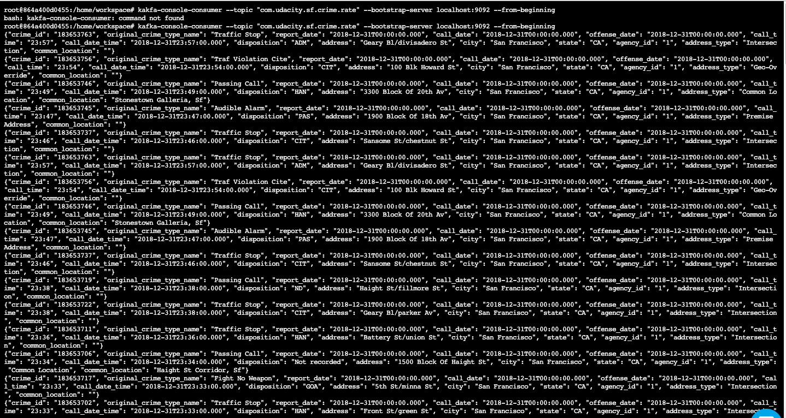
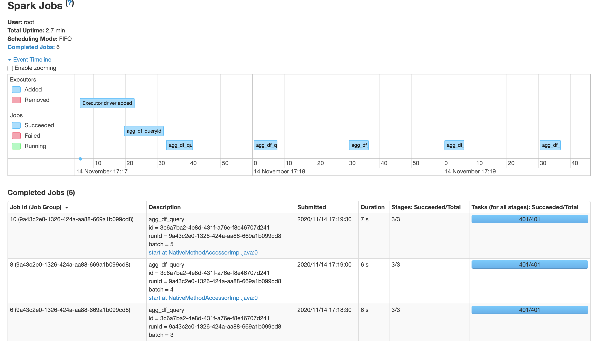
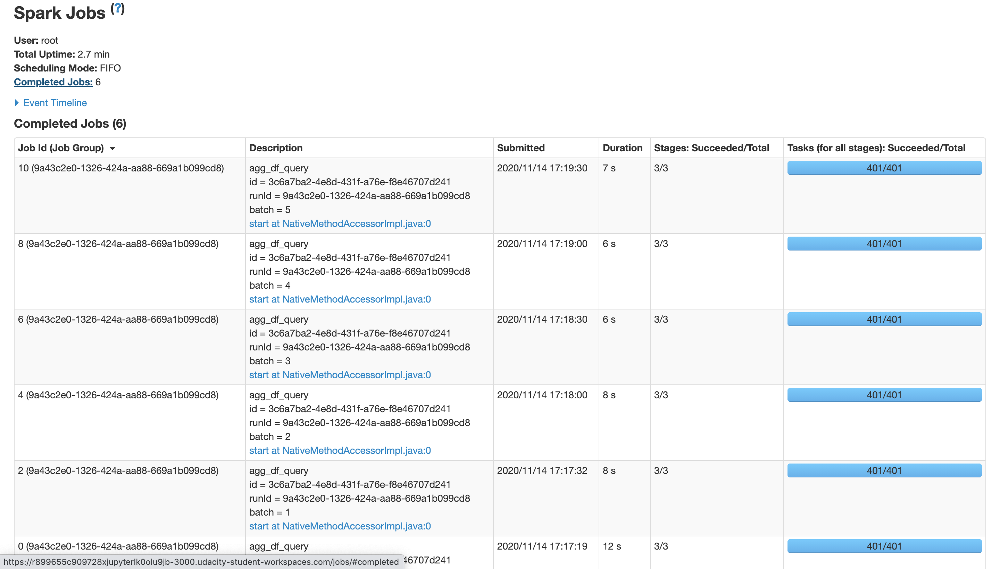
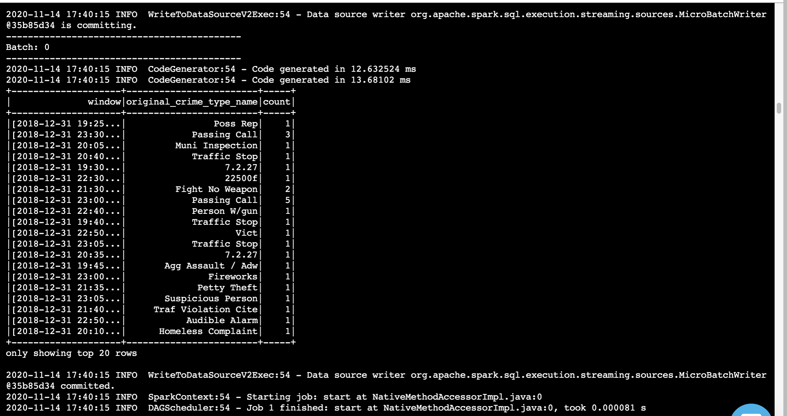
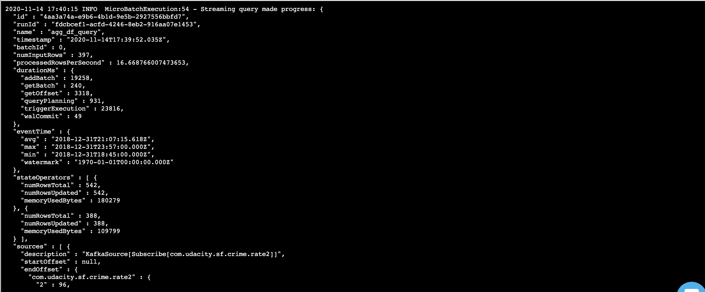
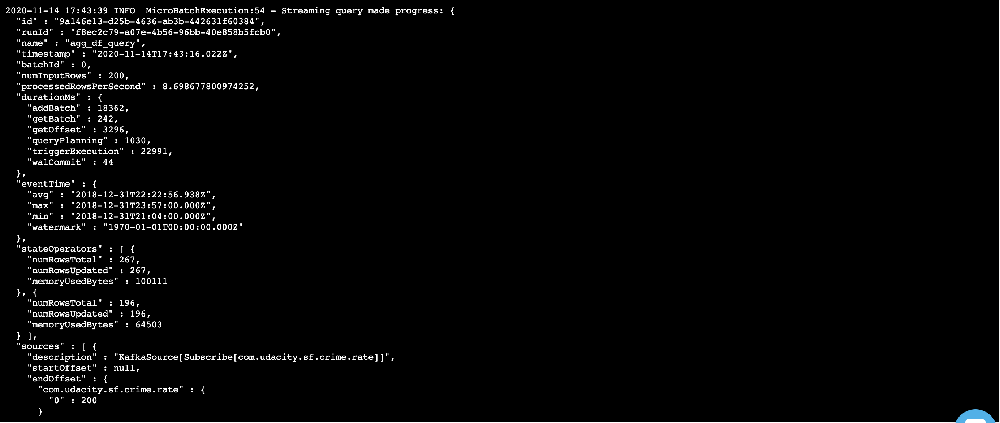
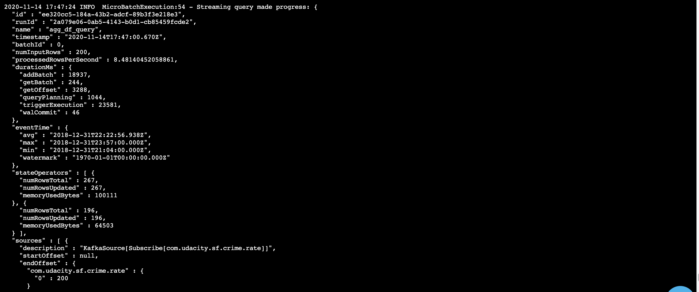

# SF-Crime-Rate-Spark

In this project, Im working with a real-world dataset, extracted from Kaggle, on San Francisco crime incidents, and I will provide statistical analyses of the data using Apache Spark Structured Streaming. I create a Kafka server to produce data, and ingest data through Spark Structured Streaming.

Kafka-Console-Consumer:

Spark UI:

Spark Console:

Progress Report:

### Q1 How did changing values on the SparkSession property parameters affect the throughput and latency of the data?

The throughput and latency of data can be controlled using the maxRatePerPartition, maxOffsetPerTrigger and the number of partitions. 

### Q2 What were the 2-3 most efficient SparkSession property key/value pairs? Through testing multiple variations on values, how can you tell these were the most optimal?

Changes in number of partitions has significant impact on the number of records being processed as multiple consumers can read simultaneously.

Case 1 - #Partitions  = 1, maxRatePerPartition = 200, maxOffsetsPerTrigger = 200

Case 2 - #Partitions  = 4, maxRatePerPartition = 50, maxOffsetsPerTrigger = 200 -> Higher throughput than case 1 due to increase in #partitions

Case 3 - #Partitions  = 1, maxRatePerPartition = 200, maxOffsetsPerTrigger = 300 -> Lower throughput and higher latency than case 1 due to out of sync values of maxRatePerPartition and maxOffsetsPerTrigger

